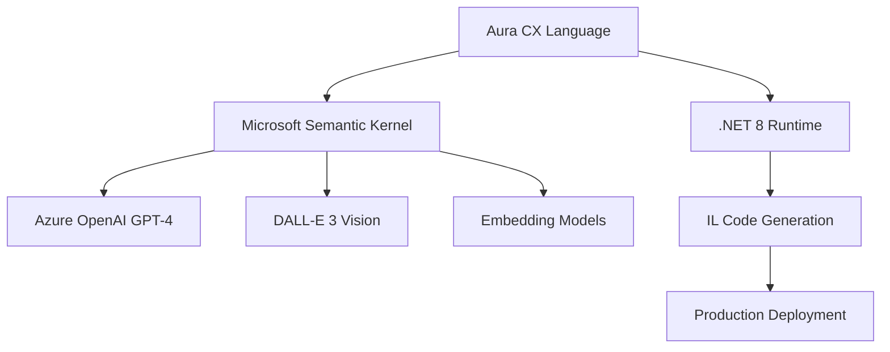

<div align="center">### 🧠 **COGNITIVE EXECUTOR - REVOLUTIONARY AI-FIRST LANGUAGE**
*Autonomous • Agentic • Enterprise-Ready*
# 🌟 **AURA** 
## *Cognitive Executor (CX) Language*
### *The Future of AI-Native Programming*

[](https://github.com/ahebert-lt/cx/actions/workflows/ci.yml)
[](https://github.com/ahebert-lt/cx)
[](https://dotnet.microsoft.com/)
[](https://azure.microsoft.com/products/ai-services/openai-service)
[](https://learn.microsoft.com/semantic-kernel/)

```
  █████╗ ██╗   ██╗██████╗  █████╗     ██████╗██╗  ██╗
 ██╔══██╗██║   ██║██╔══██╗██╔══██╗   ██╔════╝╚██╗██╔╝
 ███████║██║   ██║██████╔╝███████║   ██║      ╚███╔╝ 
 ██╔══██║██║   ██║██╔══██╗██╔══██║   ██║      ██╔██╗ 
 ██║  ██║╚██████╔╝██║  ██║██║  ██║   ╚██████╗██╔╝ ██╗
 ╚═╝  ╚═╝ ╚═════╝ ╚═╝  ╚═╝╚═╝  ╚═╝    ╚═════╝╚═╝  ╚═╝
```

### � **REVOLUTIONARY AI-FIRST PROGRAMMING LANGUAGE**
*Autonomous • Agentic • Enterprise-Ready*

</div>

---

## 🎯 **THE AURA ADVANTAGE**

<div align="center">

| � **COGNITIVE** | 🏗️ **ENTERPRISE** | ⚡ **MODERN** |
|:---:|:---:|:---:|
| AI-native execution | Production-ready architecture | .NET 8 performance |
| Autonomous agents | Azure OpenAI integration | Object-oriented |
| Self-modifying code | Enterprise security | Real-time streaming |

</div>

## ⚡ **INSTANT RESULTS**

```bash
# 🚀 Experience the Future in 30 Seconds
dotnet build CxLanguage.sln
dotnet run --project src/CxLanguage.CLI/CxLanguage.CLI.csproj run examples/class_system_demo.cx
```

---

## 🧠 **BREAKTHROUGH: AI-POWERED CODE EVOLUTION**

### **Cx.Ai.Adaptations** - *Revolutionary AI Code Generator*

```cx
// 🤖 AI writes, compiles, and executes code in real-time
using adaptations from "Cx.Ai.Adaptations";

function revolutionizeWorkflow(challenge: string)
{
    var solution = adaptations.generateCode(challenge);    // AI creates
    var compiled = adaptations.compileCode(solution);      // Auto-compile  
    var result = adaptations.executeCode(compiled);        // Execute
    return result;  // 🎯 Problem solved autonomously
}
```

### **🌟 Core Innovations**
- 🤖 **Autonomous Code Generation** - AI writes and optimizes code dynamically
- ⚡ **Runtime Code Evolution** - Self-modifying programs that improve over time
- 🛡️ **Enterprise Security** - Sandboxed execution with full audit trails
- 🎯 **Goal-Driven Programming** - Natural language to working code

---

## 🏆 **ENTERPRISE-GRADE AI ARCHITECTURE**

<div align="center">



</div>

### **🎯 Production-Ready Stack**
- ✅ **Microsoft Semantic Kernel** - Enterprise AI orchestration
- ✅ **Azure OpenAI Integration** - GPT-4, DALL-E 3, embeddings
- ✅ **Application Insights** - Real-time monitoring & analytics
- ✅ **Dependency Injection** - Scalable service architecture

---

## 💻 **DEVELOPER EXPERIENCE**

### **🔥 Object-Oriented AI Programming**
```cx
class IntelligentAgent 
{
    knowledge: string;
    
    constructor(domain: string)
    {
        this.knowledge = task("Learn everything about " + domain);
    }
    
    function solve(problem: string)
    {
        var analysis = reason(problem + " using " + this.knowledge);
        var solution = generate("Code to solve: " + analysis);
        return solution;
    }
}

// 🚀 Deploy autonomous problem-solving agents
var agent = new IntelligentAgent("cybersecurity");
var securityCode = agent.solve("Implement zero-trust authentication");
```

### **⚡ AI Service Ecosystem**
```cx
// 🎨 Multi-modal AI processing in one line
var insight = task("Analyze market trends");
var visual = generate("Create dashboard for: " + insight);  
var summary = synthesize("Executive briefing: " + insight);
```

#### **Monitoring & Telemetry**
- ✅ **Application Insights** - Complete telemetry and performance tracking
- ✅ **Error Handling** - Comprehensive exception tracking and logging
- ✅ **Usage Analytics** - AI function performance metrics and cost tracking

#### **Production Features**
- ✅ **Dependency Injection** - .NET 8 host with proper service registration
- ✅ **Configuration Management** - Flexible configuration from appsettings.json
- ✅ **Service Architecture** - Scalable and maintainable enterprise design

## 🛠️ **Core Language Features**

### ✅ **Language Fundamentals** (Phases 1-3 Complete)

#### **Data Types & Variables**
```cx
// Variable declarations with type inference
var name = "Alice";           // string
var age = 25;                 // number  
var isActive = true;          // boolean
var data = null;              // null
var items = [1, 2, 3];        // array literal
var config = {                // object literal
    key: "value",
    count: 42
};
```

#### **Operators & Expressions**
```cx
// Arithmetic with proper precedence
var result = (a + b) * c / d % e;

// Comparison operators
var isValid = age >= 18 && name != null;

// Assignment operators  
count += 5;
total *= 1.15;
text += " appended";

// Logical operators with short-circuit evaluation
var canAccess = isLoggedIn && hasPermission || isAdmin;
```

#### **Control Flow**
```cx
// Conditional statements
if (score >= 90)
{
    grade = "A";
}
else if (score >= 80)
{
    grade = "B";
}
else
{
    grade = "C";
}

// While loops
while (i < limit)
{
    process(data[i]);
    i += 1;
}

// For-in loops
for (var item in collection)
{
    print("Processing: " + item);
}
```

#### **Functions**
```cx
// Function declarations with parameters
function calculateArea(length, width)
{
    return length * width;
}

// Function calls with arguments
var area = calculateArea(10, 5);

// Async functions (grammar ready)
async function fetchData()
{
    var result = await apiCall();
    return result;
}
```

#### **Exception Handling**
```cx
// Try-catch blocks
try
{
    var result = riskyOperation();
    print("Success: " + result);
}
catch (error)
{
    print("Error occurred: " + error);
    throw "Recovery failed";
}
```

#### **Object-Oriented Programming** (Grammar Complete)
```cx
// Class declarations with inheritance
public class Vehicle
{
    private var speed;
    
    public constructor(initialSpeed)
    {
        this.speed = initialSpeed;
    }
    
    public function accelerate(increment)
    {
        this.speed += increment;
        return this.speed;
    }
}

// Class inheritance
public class Car extends Vehicle
{
    private var doors;
    
    public constructor(speed, doorCount)
    {
        super(speed);
        this.doors = doorCount;
    }
}

// Interfaces (grammar ready)
public interface Drawable
{
    function draw(): void;
    function getArea(): number;
}
```

### ✅ **Module System** 
```cx
// Import AI services from standard library
using textGen from "Cx.AI.TextGeneration";
using chatBot from "Cx.AI.ChatCompletion";
using embeddings from "Cx.AI.TextEmbeddings";

// Access modifiers
public function publicFunction() { }
private function internalFunction() { }
protected function baseClassFunction() { }
```

## 🔧 **Configuration & Setup**
### **Azure OpenAI Configuration**
Create `appsettings.json` in your project root:

```json
{
  "AzureOpenAI": {
    "ApiKey": "your-api-key-here",
    "Endpoint": "https://your-resource.openai.azure.com/",
    "DeploymentName": "gpt-4.1-nano",
    "ImageDeploymentName": "dall-e-3",
    "ApiVersion": "2024-10-21"
  },
  "ApplicationInsights": {
    "ConnectionString": "your-app-insights-connection-string"
  }
}
```

## 🚀 **Quick Start**

```bash
# Build the project
dotnet build CxLanguage.sln

# Test core language features
dotnet run --project src/CxLanguage.CLI/CxLanguage.CLI.csproj run examples/comprehensive_working_demo.cx

# Test AI service integration (requires Azure OpenAI configuration)
dotnet run --project src/CxLanguage.CLI/CxLanguage.CLI.csproj run examples/phase4_working_service_calls.cx

# Test specific language features
dotnet run --project src/CxLanguage.CLI/CxLanguage.CLI.csproj run examples/02_arithmetic.cx
```

## 📋 **Development Status**

### ✅ **Completed Phases**
- **Phase 1**: Core language fundamentals (variables, arithmetic, basic operations)
- **Phase 2**: Function system (two-pass compilation, parameters, calls, scoping)  
- **Phase 3**: Advanced features (control flow, exception handling, object literals)
- **Phase 4**: Modular AI Standard Library (service-based AI integration)

### 🚀 **Current Architecture: Standard Library Services**
- **✅ Service-Based AI**: AI capabilities are importable services, not built-in functions
- **✅ Microsoft Semantic Kernel**: Core AI orchestration framework (v1.26.0)
- **✅ Azure OpenAI Integration**: Full integration with gpt-4.1-nano and DALL-E 3  
- **✅ Async/Streaming**: Complete async support with streaming capabilities
- **✅ Telemetry & Monitoring**: Application Insights integration for observability
- **✅ Modular Design**: Each AI capability is a separate, extensible service

### 🔮 **Next Steps: Phase 4 - AI Integration**
- **Cx.Ai.Adaptations Standard Library**: AI-powered .NET IL generator for dynamic code generation
- **Vector Database Integration**: In-memory semantic search and knowledge retrieval
- **Self Keyword Implementation**: Function introspection for autonomous workflows
- **AI Function Options Objects**: Advanced configuration for AI operations
- **Multi-modal AI Processing**: Support for text, images, audio, video

## 🎯 **Language Grammar Coverage**

### ✅ **Implemented & Working**
- **Variables & Data Types**: `var`, `string`, `number`, `boolean`, `null`, arrays, objects
- **Operators**: Arithmetic (`+`, `-`, `*`, `/`, `%`), comparison, logical, assignment
- **Control Flow**: `if/else`, `while`, `for-in` loops with proper scoping
- **Functions**: Declaration, parameters, calls, return values, local variables
- **Exception Handling**: `try/catch/throw` with .NET exception integration
- **Object Literals**: `{key: value}` syntax with property access
- **Array Literals**: `[item1, item2]` syntax with indexing
- **Classes & Object-Oriented Programming**: `class`, constructors, methods, field assignments, instantiation
- **AI Integration**: Azure OpenAI service calls with `task()`, `reason()`, `synthesize()`, etc.

### 🔄 **Grammar Complete, Implementation Pending**
- **Class Inheritance**: `extends` keyword and inheritance hierarchy
- **Interfaces**: `interface`, method signatures, property declarations  
- **Access Modifiers**: `public`, `private`, `protected`
- **Interfaces**: `interface`, method signatures, property declarations  
- **Access Modifiers**: `public`, `private`, `protected`
- **Async/Await**: `async function`, `await expression`, `parallel execution`
- **Advanced Types**: Generic types, type annotations, custom types

### 📊 **Standard Library Services Available**

| Service | Namespace | Status | Key Methods |
|---------|-----------|--------|-------------|
| **Text Generation** | `Cx.AI.TextGeneration` | ✅ | `GenerateAsync`, `GenerateStreamAsync` |
| **Chat Completion** | `Cx.AI.ChatCompletion` | ✅ | `CompleteAsync`, `StartConversationAsync` |
| **Text Embeddings** | `Cx.AI.TextEmbeddings` | ✅ | `GenerateEmbeddingAsync`, `FindSimilarAsync` |
| **Text-to-Image** | `Cx.AI.TextToImage` | ✅ | `GenerateImageAsync`, `GenerateVariationsAsync` |
| **Image-to-Text** | `Cx.AI.ImageToText` | ✅ | `AnalyzeImageAsync`, `ExtractTextAsync` |
| **Text-to-Speech** | `Cx.AI.TextToSpeech` | ✅ | `SynthesizeAsync`, `SynthesizeStreamAsync` |
| **Audio-to-Text** | `Cx.AI.AudioToText` | ✅ | `TranscribeAsync`, `StartRealtimeAsync` |
| **Text-to-Audio** | `Cx.AI.TextToAudio` | ✅ | `GenerateAudioAsync`, `ProcessAudioAsync` |
| **Realtime AI** | `Cx.AI.Realtime` | ✅ | `StartSessionAsync`, `SendMessageAsync` |

## 💡 **Example: Complete AI Application**

```cx
// Import AI services from standard library
using textGen from "Cx.AI.TextGeneration";
using chatBot from "Cx.AI.ChatCompletion";
using embeddings from "Cx.AI.TextEmbeddings";
using imageGen from "Cx.AI.TextToImage";

function buildIntelligentApp()
{
    print("=== Building Intelligent CX Application ===");
    
    // 1. Generate creative content
    var storyPrompt = "Write a sci-fi story about AI and humans";
    var options = { 
        temperature: 0.8, 
        maxTokens: 1000,
        stream: true 
    };
    var story = textGen.GenerateAsync(storyPrompt, options);
    print("Generated Story: " + story);
    
    // 2. Interactive conversation
    var conversation = chatBot.StartConversationAsync("You are a creative writing assistant");
    var response = chatBot.ContinueConversationAsync(conversation, "What makes good sci-fi?");
    print("AI Advice: " + response);
    
    // 3. Semantic understanding
    var storyEmbedding = embeddings.GenerateEmbeddingAsync(story);
    var similarTexts = embeddings.FindSimilarAsync("space exploration", storyEmbedding);
    print("Similar themes found: " + similarTexts);
    
    // 4. Visual content generation
    var imagePrompt = "A futuristic cityscape from the story: " + story.substring(0, 100);
    var artwork = imageGen.GenerateImageAsync(imagePrompt, { size: "1024x1024" });
    print("Generated artwork URL: " + artwork);
    
    // 5. Combine results into final product
    var result = {
        story: story,
        advice: response,
        themes: similarTexts,
        artwork: artwork,
        timestamp: "2025-01-18"
    };
    
    return result;
}

// Exception handling with AI services
function robustAIProcessing()
{
    try
    {
        var result = buildIntelligentApp();
        print("✅ AI application completed successfully");
        return result;
    }
    catch (error)
    {
        print("❌ AI processing error: " + error);
        
        // Fallback AI processing
        var fallback = textGen.GenerateAsync("Generate a simple greeting");
        return { fallback: fallback, error: error };
    }
}

// Run the intelligent application
var appResult = robustAIProcessing();
print("Final Result: " + appResult);
```

## 📚 **Documentation & Resources**

### **Language Reference**
- **[Language Syntax Guide](docs/syntax.md)** - Complete syntax reference
- **[Standard Library Reference](src/CxLanguage.StandardLibrary/README.md)** - AI services documentation
- **[Grammar Specification](grammar/Cx.g4)** - ANTLR4 grammar definition
- **[Implementation Status](docs/implementation-status.md)** - Feature completion tracking

### **Example Projects**
- **[Core Language Examples](examples/)** - Basic language feature demonstrations
- **[AI Service Examples](examples/phase4_*)** - AI integration examples
- **[Comprehensive Demo](examples/comprehensive_working_demo.cx)** - Full feature showcase

### **Development**
- **[Quick Reference](docs/quick-reference.md)** - Developer cheat sheet
- **[Build Instructions](QUICKSTART.md)** - Setup and compilation guide
- **[Contributing Guidelines](CONTRIBUTING.md)** - How to contribute to CX

## 🏗️ **Architecture**

### **Compiler Architecture**
- **Parser**: ANTLR4-based parser with comprehensive grammar
- **AST Builder**: Abstract syntax tree construction and validation
- **Two-Pass Compilation**: Function declaration collection + body compilation
- **IL Generation**: Direct .NET IL emission for optimal performance
- **Type System**: Dynamic typing with optional static type annotations

### **Standard Library Architecture**
- **Microsoft Semantic Kernel 1.26.0**: Core AI orchestration
- **Service Interface Pattern**: Consistent `ICxAiService` implementation
- **Dependency Injection**: Service provider pattern for extensibility  
- **Async/Streaming**: Non-blocking operations with streaming support
- **Telemetry Integration**: Application Insights monitoring

### **AI Integration Architecture**
- **Azure OpenAI**: Primary AI service provider (gpt-4.1-nano, DALL-E 3)
- **Service Registration**: Dynamic service discovery and injection
- **Error Handling**: Comprehensive exception handling and recovery
- **Configuration Management**: Flexible appsettings.json configuration
- **Performance Monitoring**: Real-time metrics and usage tracking

---

**Ready to build the future of AI-native programming? [Get started with Aura today! 🚀](QUICKSTART.md)**
```

## 📋 **Development Status**

### ✅ **Completed Phases**
- **Phase 1**: Core language fundamentals (variables, arithmetic, basic operations)
- **Phase 2**: Function system (two-pass compilation, parameters, calls, scoping)  
- **Phase 3**: Advanced features (control flow, exception handling, object literals)
- **Phase 4**: Modular AI Standard Library (service-based AI integration)

### � **Current Architecture: Standard Library Services**
- **✅ Service-Based AI**: AI capabilities are importable services, not built-in functions
- **✅ Microsoft Semantic Kernel**: Core AI orchestration framework (v1.26.0)
- **✅ Azure OpenAI Integration**: Full integration with gpt-4.1-nano and DALL-E 3  
- **✅ Async/Streaming**: Complete async support with streaming capabilities
- **✅ Telemetry & Monitoring**: Application Insights integration for observability
- **✅ Modular Design**: Each AI capability is a separate, extensible service

### � **Next Steps: Phase 5 - Autonomous Agentic Features**
- **Multi-Agent Coordination**: Agent-to-agent communication and coordination
- **Vector Database Integration**: Semantic search and knowledge retrieval
- **Learning & Adaptation**: Self-improving agent capabilities
- **Self-Modification**: Runtime code generation and optimization

## 🎯 **Language Grammar Coverage**

### ✅ **Implemented & Working**
- **Variables & Data Types**: `var`, `string`, `number`, `boolean`, `null`, arrays, objects
- **Operators**: Arithmetic (`+`, `-`, `*`, `/`, `%`), comparison, logical, assignment
- **Control Flow**: `if/else`, `while`, `for-in` loops with proper scoping
- **Functions**: Declaration, parameters, calls, return values, local variables
- **Exception Handling**: `try/catch/throw` with .NET exception integration
- **Object Literals**: `{key: value}` syntax with property access
- **Array Literals**: `[item1, item2]` syntax with indexing
- **Service Imports**: `using service from "namespace"` module system

### 🔄 **Grammar Complete, Implementation Pending**
- **Classes & Inheritance**: `class`, `extends`, constructors, methods
- **Interfaces**: `interface`, method signatures, property declarations  
- **Access Modifiers**: `public`, `private`, `protected`
- **Async/Await**: `async function`, `await expression`, `parallel execution`
- **Advanced Types**: Generic types, type annotations, custom types

### 📊 **Standard Library Services Available**

| Service | Namespace | Status | Key Methods |
|---------|-----------|--------|-------------|
| **Text Generation** | `Cx.AI.TextGeneration` | ✅ | `GenerateAsync`, `GenerateStreamAsync` |
| **Chat Completion** | `Cx.AI.ChatCompletion` | ✅ | `CompleteAsync`, `StartConversationAsync` |
| **Text Embeddings** | `Cx.AI.TextEmbeddings` | ✅ | `GenerateEmbeddingAsync`, `FindSimilarAsync` |
| **Text-to-Image** | `Cx.AI.TextToImage` | ✅ | `GenerateImageAsync`, `GenerateVariationsAsync` |
| **Image-to-Text** | `Cx.AI.ImageToText` | ✅ | `AnalyzeImageAsync`, `ExtractTextAsync` |
| **Text-to-Speech** | `Cx.AI.TextToSpeech` | ✅ | `SynthesizeAsync`, `SynthesizeStreamAsync` |
| **Audio-to-Text** | `Cx.AI.AudioToText` | ✅ | `TranscribeAsync`, `StartRealtimeAsync` |
| **Text-to-Audio** | `Cx.AI.TextToAudio` | ✅ | `GenerateAudioAsync`, `ProcessAudioAsync` |
| **Realtime AI** | `Cx.AI.Realtime` | ✅ | `StartSessionAsync`, `SendMessageAsync` |
- **Authentication**: ✅ **WORKING** - API key authentication functional
- **Configuration**: ✅ **WORKING** - appsettings.json support
- **Error Handling**: ✅ **WORKING** - Comprehensive exception tracking
- **Telemetry**: ✅ **WORKING** - Application Insights monitoring

#### **Current Status & Limitations**
- **AI Services**: ✅ **COMPLETE** - Full service library with 8+ AI services operational
- **Service Registration**: ✅ **COMPLETE** - Dependency injection and configuration management
- **Azure OpenAI Integration**: ✅ **COMPLETE** - Production-ready with real API calls
- **Vector Database**: 🔄 **PARTIAL** - Basic embedding support, advanced search pending
- **Multi-Modal Processing**: ✅ **WORKING** - Text, image generation/analysis via services
```cx
// Variables and data types
var message = "Hello, CX!";
var count = 42;
var isActive = true;

// Arithmetic with proper precedence
var result = 10 + 5 * 2;  // 20

// Compound assignments
var total = 100;
total += 50;  // 150

// Comparison and logical operators
if (score >= 90 && isActive) 
{
    print("Excellent!");
}

// Function declarations and calls with return values
function add(a, b) 
{
    return a + b;
}

var sum = add(10, 20);  // 30
print("Sum: " + sum);

// For-in loops with arrays
var fruits = ["apple", "banana", "cherry"];
for (var fruit in fruits) 
{
    print("Fruit: " + fruit);
}

// Exception handling with try/catch/throw
try 
{
    throw "Something went wrong!";
}
catch (error) 
{
    print("Caught: " + error);
}
```

## 🏗️ **Architecture**

### Project Structure
```
CxLanguage.sln
├── src/
│   ├── CxLanguage.CLI/         # Command-line interface
│   ├── CxLanguage.Compiler/    # IL code generation
│   ├── CxLanguage.Parser/      # ANTLR4-based parser
│   ├── CxLanguage.Core/        # AST and core types
│   ├── CxLanguage.Runtime/     # Runtime support
│   └── CxLanguage.Azure/       # Azure AI services integration
├── grammar/Cx.g4               # ANTLR4 grammar definition
├── examples/                   # Example .cx files
└── tests/                      # Unit tests
```

### Technology Stack
- **.NET 8**: Target runtime platform
- **ANTLR 4**: Grammar definition and parsing
- **System.Reflection.Emit**: Dynamic IL generation
- **Microsoft Semantic Kernel**: AI orchestration and workflow management (CORE AI ENGINE)
- **Azure OpenAI**: AI model integration via Semantic Kernel
- **Two-pass compilation**: Function forward references and proper scoping

### AI Integration Architecture (Powered by Semantic Kernel)
- **Semantic Kernel**: Core AI orchestration engine providing all AI capabilities
- **Chat Completion**: Advanced conversational AI via Azure OpenAI integration
- **Text Embeddings**: Vector representations for semantic search operations
- **Vision Processing**: Image understanding and description capabilities
- **Audio Processing**: Speech-to-text and text-to-speech conversion
- **Streaming Responses**: Real-time AI processing and response generation
- **Multi-Modal Integration**: Unified processing across text, image, and audio content
- **Function Calling**: AI-driven function discovery and execution
- **Memory Management**: Persistent context and conversation history
- **Vector Database**: In-memory semantic search and retrieval
- **Agent Memory**: Persistent context and learning capabilities
- **Self-Modification**: Function introspection and adaptation

## �️ **Building and Running**

### Prerequisites
- .NET 8.0 SDK
- Visual Studio 2022 or VS Code
- Azure OpenAI API key (for AI features)

### Build Commands
```bash
# Build the solution
dotnet build CxLanguage.sln

# Test working AI services integration
dotnet run --project src/CxLanguage.CLI/CxLanguage.CLI.csproj run examples/test_ai_functions.cx

# Test basic functionality
dotnet run --project src/CxLanguage.CLI/CxLanguage.CLI.csproj run examples/simple_test.cx

# Test arithmetic operations
dotnet run --project src/CxLanguage.CLI/CxLanguage.CLI.csproj run examples/02_arithmetic.cx
```

### Current Build Status
- ✅ **Solution Builds**: All projects compile successfully
- ✅ **Basic Execution**: Simple programs run correctly  
- ✅ **AI Integration**: AI services library operational with Azure OpenAI
- 🔄 **Complex Features**: Some advanced examples need fixes

## � **Configuration & Setup**
```json
{
  "AzureOpenAI": {
    "Endpoint": "https://your-resource.openai.azure.com/",
    "DeploymentName": "gpt-4",
    "EmbeddingDeploymentName": "text-embedding-3-small",
    "ApiVersion": "2024-02-01"
  }
}
```

### **Environment Variables**
```bash
# Azure authentication (recommended)
export AZURE_CLIENT_ID="your-client-id"
export AZURE_CLIENT_SECRET="your-client-secret"
export AZURE_TENANT_ID="your-tenant-id"

# Enable Semantic Kernel features
export SEMANTIC_KERNEL_ENABLE_STREAMING=true
export SEMANTIC_KERNEL_ENABLE_MEMORY=true
```

## 🎯 **AI Agentic Vision**

### **Why Cx for Autonomous Agents?**
- 🤖 **AI-Native**: AI services are integrated into the language ecosystem
- 🎯 **Goal-Directed**: Natural language goal interpretation via AI services
- 🔄 **Self-Modifying**: Adaptation capabilities through AI service integration
- 📚 **Learning-Enabled**: Foundation for continuous improvement
- 🌐 **Environment-Aware**: Azure OpenAI integration for external AI services
- ⚡ **Async-Ready**: Grammar supports async/await patterns
- 🚀 **Runtime Adaptation**: Framework for dynamic code modification

### **Current Autonomous Capabilities** (Phase 4 COMPLETE)
- **🎯 Goal Interpretation**: Working via TextGeneration service with Azure OpenAI
- **🧠 AI Reasoning**: Functional via ChatCompletion service with conversational AI
- **🔄 Code Generation**: Available via ChatCompletion service for code synthesis
- **🔍 Vector Processing**: Full embedding generation and similarity via TextEmbeddings service
- **🎨 Visual Creation**: Image generation via TextToImage service (DALL-E 3)
- **👁️ Visual Analysis**: Image understanding via ImageToText service (GPT-4 Vision)
- **⚡ Live AI Services**: Connected to Azure OpenAI with full service library
- **🗣️ Speech Processing**: Text-to-speech and audio-to-text capabilities

### **Planned Autonomous Features** (Phase 5)
- **🗺️ Autonomous Planning**: Advanced task breakdown and execution orchestration
- **🔧 Tool Integration**: Dynamic environment discovery and API integration
- **📚 Learning & Adaptation**: Real-time feedback integration and model improvement
- **🔄 Advanced Self-Modification**: Runtime code synthesis and behavioral adaptation
- **🤖 Multi-Agent Coordination**: Agent-to-agent communication and collaboration

## 🤝 Contributing

We welcome contributions to Aura's Cognitive Executor language! Current priority areas:

### **Phase 5 Enhancement Focus**
- **Service Optimization**: Improve performance and reliability of existing AI services
- **Advanced Configuration**: Enhance service configuration and customization options
- **Vector Database Integration**: Expand beyond basic embedding support to full semantic search
- **Multi-Modal Workflows**: Create comprehensive multi-modal processing pipelines
- **Error Handling & Resilience**: Improve service error handling and recovery mechanisms

### **Code Standards**
- Follow existing C# coding conventions
- Use Allman-style brackets in all Aura CX examples
- Add comprehensive XML documentation
- Include unit tests for new features
- All .cx files must be placed in the `examples/` folder
- Update examples to demonstrate new capabilities

### **Testing Current Features**
```bash
# Test working functionality (should pass)
dotnet run --project src/CxLanguage.CLI/CxLanguage.CLI.csproj run examples/simple_test.cx
dotnet run --project src/CxLanguage.CLI/CxLanguage.CLI.csproj run examples/test_ai_functions.cx

# Test basic language features  
dotnet run --project src/CxLanguage.CLI/CxLanguage.CLI.csproj run examples/02_arithmetic.cx
```

### **Getting Started**
1. Fork the repository
2. Create a feature branch: `git checkout -b feature/phase5-enhancement`
3. Follow the coding guidelines in `.github/copilot-instructions.md`
4. Add tests for new functionality
5. Submit a pull request

## 📄 License

MIT License - see [LICENSE](LICENSE) for details.

## 🙏 Acknowledgments

- **Microsoft Semantic Kernel** - AI orchestration and workflow management
- **Azure OpenAI** - AI model integration and capabilities
- **ANTLR 4** - Grammar definition and parsing framework
- **.NET Team** - Runtime platform and IL generation capabilities

---

**Aura - Cognitive Executor (CX) - The First AI-Native Agentic Programming Language** �🚀

*Building the foundation for AI-native programming with familiar syntax and powerful autonomous capabilities.*
