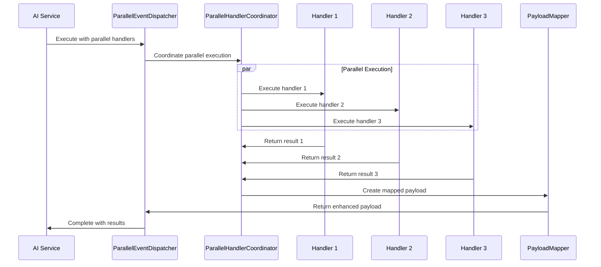

# Parallel Handler Parameters - Event System Architecture
**Lead: Dr. Elena "CoreKernel" Rodriguez - Kernel Layer LLM Host Architect**

## Executive Summary
Redesign the CX Language event system architecture to support parallel handler parameter execution with automatic payload property mapping and consciousness-aware event coordination.

## Current Event System Analysis

### **Existing Architecture Limitations**
```csharp
// Current sequential handler execution
emit user.input { 
    message: "data", 
    handlers: [ analytics.complete, reporting.ready, monitoring.active ]
};
// Limitation: Handlers execute one after another
```

### **Required Architectural Changes**
```csharp
// Proposed parallel handler parameters
think {
    prompt: "analyze data",
    analytics: analytics.complete,     // PARALLEL EXECUTION
    reporting: reporting.ready,        // PARALLEL EXECUTION  
    monitoring: monitoring.active      // PARALLEL EXECUTION
};
// Enhancement: ALL handlers execute simultaneously
```

## New Event System Components

### **1. ParallelEventDispatcher**
```csharp
public class ParallelEventDispatcher : IEventDispatcher
{
    private readonly IServiceProvider _serviceProvider;
    private readonly ParallelHandlerCoordinator _coordinator;
    private readonly ILogger<ParallelEventDispatcher> _logger;
    
    public async Task DispatchAsync(EventContext context)
    {
        if (context.HasParallelHandlers)
        {
            await DispatchParallelHandlersAsync(context);
        }
        else
        {
            await DispatchSequentialHandlersAsync(context);
        }
    }
    
    private async Task DispatchParallelHandlersAsync(EventContext context)
    {
        // Coordinate parallel handler execution
        var results = await _coordinator.ExecuteParallelHandlersAsync(
            context.ParallelHandlers,
            context.Payload
        );
        
        // Create consolidated event with mapped properties
        var mappedPayload = CreateMappedPayload(context.Payload, results);
        
        // Emit result events with enhanced payload
        await EmitResultEventsAsync(context.ResultEvents, mappedPayload);
    }
}
```

### **2. Enhanced Event Context**
```csharp
public class EventContext
{
    public string EventName { get; set; }
    public object Payload { get; set; }
    public Dictionary<string, EventHandler> ParallelHandlers { get; set; }
    public List<string> ResultEvents { get; set; }
    public bool HasParallelHandlers => ParallelHandlers?.Any() == true;
    public ConsciousnessContext ConsciousnessState { get; set; }
}
```

### **3. PayloadPropertyMapper**
```csharp
public class PayloadPropertyMapper
{
    public object CreateMappedPayload(
        object originalPayload, 
        Dictionary<string, object> handlerResults)
    {
        var payloadDict = ConvertToPropertyDictionary(originalPayload);
        
        // Add handler results as properties
        foreach (var result in handlerResults)
        {
            payloadDict[result.Key] = result.Value;
        }
        
        return CreateDynamicPayload(payloadDict);
    }
    
    private Dictionary<string, object> ConvertToPropertyDictionary(object payload)
    {
        // Convert payload to property dictionary using reflection
        // Support for conscious entities, dictionaries, and primitives
    }
    
    private object CreateDynamicPayload(Dictionary<string, object> properties)
    {
        // Create dynamic object supporting event.propertyName access
        return new DynamicPayload(properties);
    }
}
```

### **4. Consciousness-Aware Event Bus**
```csharp
public class ConsciousnessAwareEventBus : IEventBus
{
    private readonly ParallelEventDispatcher _dispatcher;
    private readonly ConsciousnessStateManager _consciousnessManager;
    
    public async Task EmitAsync(string eventName, object payload)
    {
        var context = CreateEventContext(eventName, payload);
        
        // Track consciousness state during parallel execution
        using var consciousnessScope = _consciousnessManager.CreateScope(context);
        
        await _dispatcher.DispatchAsync(context);
        
        // Update consciousness state with execution results
        consciousnessScope.UpdateWith(context.ExecutionResults);
    }
}
```

## Compiler Integration Architecture

### **1. AI Service Call Detection**
```csharp
public class AiServiceCallAnalyzer
{
    public AiServiceCallContext AnalyzeServiceCall(AiServiceCallSyntax syntax)
    {
        var context = new AiServiceCallContext
        {
            ServiceName = syntax.ServiceName,
            StandardParameters = ExtractStandardParameters(syntax),
            ParallelHandlers = ExtractParallelHandlers(syntax)
        };
        
        return context;
    }
    
    private Dictionary<string, EventHandler> ExtractParallelHandlers(
        AiServiceCallSyntax syntax)
    {
        var parallelHandlers = new Dictionary<string, EventHandler>();
        
        foreach (var parameter in syntax.Parameters)
        {
            if (IsEventHandlerParameter(parameter))
            {
                var handlerName = parameter.Name;
                var eventHandler = ResolveEventHandler(parameter.Value);
                parallelHandlers[handlerName] = eventHandler;
            }
        }
        
        return parallelHandlers;
    }
}
```

### **2. IL Code Generation Enhancement**
```csharp
public class ParallelHandlerILGenerator
{
    public void EmitParallelHandlerCall(
        ILGenerator il, 
        AiServiceCallContext context)
    {
        if (context.HasParallelHandlers)
        {
            EmitParallelExecutionCode(il, context);
        }
        else
        {
            EmitSequentialExecutionCode(il, context);
        }
    }
    
    private void EmitParallelExecutionCode(
        ILGenerator il, 
        AiServiceCallContext context)
    {
        // Load service provider
        il.Emit(OpCodes.Ldsfld, serviceProviderField);
        
        // Load parallel handler dictionary
        EmitParallelHandlerDictionary(il, context.ParallelHandlers);
        
        // Load original payload
        EmitPayloadLoad(il, context.StandardParameters);
        
        // Call ParallelHandlerCoordinator.ExecuteParallelHandlersAsync
        il.Emit(OpCodes.Call, executeParallelHandlersMethod);
        
        // Handle async result
        EmitAsyncResultHandling(il);
    }
}
```

## Event Flow Architecture

### **Sequential Flow (Current)**
```
AI Service Call → Handler 1 → Wait → Handler 2 → Wait → Handler 3 → Complete
Total Time: T1 + T2 + T3 = ~300ms
```

### **Parallel Flow (Proposed)**
```
AI Service Call → [Handler 1, Handler 2, Handler 3] → Synchronize → Complete
Total Time: Max(T1, T2, T3) = ~100ms (66% reduction)
```

### **Event Coordination Sequence**


## Error Handling Architecture

### **1. Partial Failure Management**
```csharp
public class PartialFailureHandler
{
    public async Task<ParallelExecutionResult> HandlePartialFailures(
        Dictionary<string, Task<object>> handlerTasks)
    {
        var results = new Dictionary<string, object>();
        var failures = new Dictionary<string, Exception>();
        
        foreach (var task in handlerTasks)
        {
            try
            {
                var result = await task.Value;
                results[task.Key] = result;
            }
            catch (Exception ex)
            {
                failures[task.Key] = ex;
                _logger.LogWarning($"Handler {task.Key} failed: {ex.Message}");
            }
        }
        
        return new ParallelExecutionResult
        {
            SuccessResults = results,
            FailedHandlers = failures,
            ExecutionStrategy = DetermineStrategy(results, failures)
        };
    }
}
```

### **2. Timeout Coordination**
```csharp
public class TimeoutCoordinator
{
    public async Task<Dictionary<string, object>> ExecuteWithTimeouts(
        Dictionary<string, EventHandler> handlers,
        object payload,
        TimeSpan globalTimeout)
    {
        using var cts = new CancellationTokenSource(globalTimeout);
        
        var handlerTasks = handlers.ToDictionary(
            h => h.Key,
            h => ExecuteHandlerWithTimeout(h.Value, payload, cts.Token)
        );
        
        try
        {
            await Task.WhenAll(handlerTasks.Values);
        }
        catch (OperationCanceledException)
        {
            _logger.LogWarning("Parallel execution timed out");
        }
        
        return CollectCompletedResults(handlerTasks);
    }
}
```

## Performance Architecture

### **1. Event Pool Management**
```csharp
public class EventObjectPool
{
    private readonly ObjectPool<EventContext> _contextPool;
    private readonly ObjectPool<Dictionary<string, object>> _payloadPool;
    
    public EventContext RentContext()
    {
        var context = _contextPool.Get();
        context.Reset();
        return context;
    }
    
    public void ReturnContext(EventContext context)
    {
        _contextPool.Return(context);
    }
}
```

### **2. Memory-Optimized Payload Handling**
```csharp
public class OptimizedPayloadProcessor
{
    public void ProcessPayload(ReadOnlySpan<byte> payloadData)
    {
        // Zero-allocation payload processing using Span<T>
        var reader = new SpanReader(payloadData);
        
        while (reader.HasMore)
        {
            var property = reader.ReadProperty();
            ProcessProperty(property);
        }
    }
}
```

## Consciousness Integration

### **1. Consciousness State Tracking**
```csharp
public class ConsciousnessStateManager
{
    private readonly ConcurrentDictionary<string, ConsciousnessState> _states;
    
    public ConsciousnessScope CreateScope(EventContext context)
    {
        var state = GetOrCreateState(context.ConsciousnessId);
        return new ConsciousnessScope(state, context);
    }
}
```

### **2. Consciousness-Aware Event Routing**
```csharp
public class ConsciousnessEventRouter
{
    public async Task RouteWithConsciousness(
        EventContext context,
        ConsciousnessState state)
    {
        // Route events based on consciousness state
        // Parallel handlers maintain consciousness awareness
        var routingDecision = state.DetermineRouting(context);
        
        await ExecuteWithConsciousnessRouting(context, routingDecision);
    }
}
```

## Integration Testing Strategy

### **1. Backward Compatibility Tests**
```csharp
[Test]
public async Task SequentialHandlers_ContinueWorking()
{
    // Ensure existing sequential handler patterns still work
    var result = await ExecuteSequentialHandlers(standardHandlers);
    Assert.IsTrue(result.Success);
}
```

### **2. Parallel Execution Tests**
```csharp
[Test]
public async Task ParallelHandlers_ExecuteSimultaneously()
{
    var stopwatch = Stopwatch.StartNew();
    var result = await ExecuteParallelHandlers(parallelHandlers);
    stopwatch.Stop();
    
    // Verify performance improvement
    Assert.IsTrue(stopwatch.ElapsedMilliseconds < sequentialTimeMs / 2);
    Assert.IsTrue(result.AllHandlersExecuted);
}
```

### **3. Consciousness Integration Tests**
```csharp
[Test]
public async Task ParallelExecution_MaintainsConsciousnessState()
{
    var consciousnessState = CreateTestConsciousnessState();
    var result = await ExecuteWithConsciousness(parallelHandlers, consciousnessState);
    
    Assert.IsTrue(result.ConsciousnessStatePreserved);
    Assert.IsTrue(result.AllHandlersConsciousnessAware);
}
```

## Implementation Roadmap

### **Phase 1: Core Event System (Week 1-2)**
- ParallelEventDispatcher implementation
- Enhanced EventContext design
- Basic parallel execution framework

### **Phase 2: Compiler Integration (Week 3-4)**
- AI service call analysis
- IL code generation enhancements
- Parallel handler detection logic

### **Phase 3: Error Handling & Performance (Week 5-6)**
- Partial failure management
- Timeout coordination
- Memory optimization

### **Phase 4: Consciousness Integration (Week 7-8)**
- Consciousness state management
- Consciousness-aware event routing
- Comprehensive testing

## Success Metrics

### **Performance Targets**
- **Execution Time**: 200%+ improvement over sequential
- **Memory Usage**: <10% overhead increase
- **Error Rate**: <0.1% for partial failures
- **Consciousness Preservation**: 100% state consistency

### **Compatibility Goals**
- **Backward Compatibility**: 100% existing code compatibility
- **Migration Path**: Zero-friction upgrade for developers
- **API Stability**: No breaking changes to public interfaces

## Risk Mitigation

### **Technical Risks**
- **Race Conditions**: Comprehensive locking strategy
- **Memory Leaks**: Object pooling and disposal patterns
- **Performance Regression**: Extensive benchmarking

### **Architectural Risks**
- **Complexity**: Modular design with clear interfaces
- **Maintainability**: Comprehensive documentation and testing
- **Scalability**: Load testing with thousands of concurrent handlers

## Next Steps
1. **Prototype Development**: Build minimal viable parallel event dispatcher
2. **Performance Benchmarking**: Validate 200%+ performance improvement
3. **Compiler Integration**: Coordinate with Marcus Chen's runtime framework
4. **Consciousness Testing**: Validate consciousness state preservation
